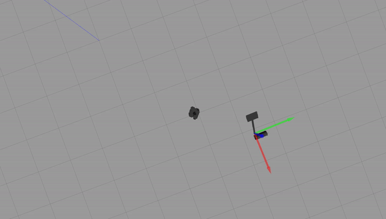
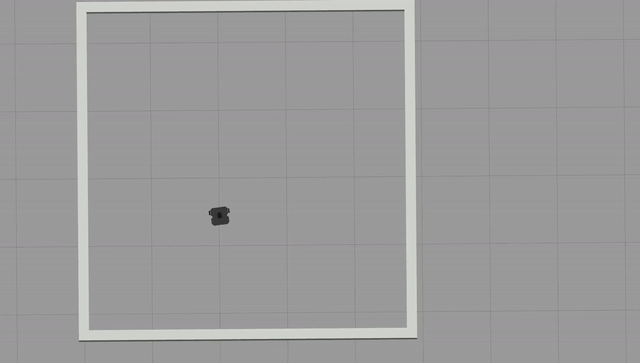

# warmup_project
**Robot Behaviors**

*Drive in a square:* In order to allow the robot to drive in a square we need 2 basic components, a 90 degree (or close) turn, and a forward movement of consistent distance.
  - Main: initializes an object of *SendTwistData*, and calls its run function
  - Init: creates the ROS node and creates the publisher to post the cmd_vel commands
  - Run: first we create two vectors, a *my_straight_vel* which contains a vector to drive straight, and a *my_turn_vel* which contains a vector to turn. We then set a few starting values to go straight before turning, and then start the loop. The loop checks whether we should be going straight or turning, and publishes the correct vector. Then we have a loop that sleeps either 10 or 50 ticks depending on whether we're driving straight or turning to get a good shape for the square. Lastly we swap between turning or going straight and vice versa, and reset our count.

*Person follower:* In order to follow a "person" we need 2 components. First we need to turn to face them, and then we need to be able to drive towards them but stop before we get too close.
 - Main: Similar to driving in a square, it simply calls the run function
 - Init: creates the ROS node, as well as a publisher for cmd_vel and a subscriber to scan. This also sets the object's internal variables to be used accross other functions.
 - Run: First it calls *getClosestObject()* to determine what angle to rotate to. Then if the angle is outside the tolerace set by *deg_tol* it calls *turnToAngle()* to rotate to the correct angle. Once the angle is achieved, the robot will use the scanned distance at angle 0 to determine if it is too close or too far. If it is too far it moves forward, otherwise it stops.
 - Callback: stores the value of the callback message into a local variable
 - getClosestObject: determines at which angle the closest object is, relative to the front of the robot.
 - turnToAngle: given a current angle and a goal, the function calculates the correct way to turn, such that the robot should never turn more than 180 degrees to get to an angle. Then it publishes to cmd_vel to ensure the robot turns to the correct direction.
 
 
 *Wall follower:* This feature operates using nearly identical functions to the person follower, except the logic within the run function has multiple states that are mantained to help the robot only turn when it is actually in a corner, and to approach the nearest wall.
 - Main: Similar to driving in a square, it simply calls the run function
 - Init: creates the ROS node, as well as a publisher for cmd_vel and a subscriber to scan. This also sets the object's internal variables to be used accross other functions. These internal variables include various boolean functions to control the robot's state.
 - Run: First it calls *getClosestWall()* to determine what angle to rotate to. Then if the angle is outside the tolerace set by *deg_tol* it calls *turnToAngle()* to rotate to the correct angle. Once the angle is achieved, the *wall_found* is set to true, and the loop then directs the robot to approach the wall until it is within 0.5. This sets *near_wall* to true. Then the loop rotates the robot to be parallel to the wall and ready to follow it, setting perp_wall to true. Then the robot drives until it is in the corner, and if it strays too far away from the wall it turns back towards it slightly, and the same for if it goes too far. Once it reaches the corner, *in_corner* is set to true, and the robot turns 90 degrees counterclockwise, and resets *in_corner* to false. This loop will allow the robot to repeatedly follow the wall.
 - Callback: stores the value of the callback message into a local variable
 - getClosestWall: determines at which angle the closest object is, relative to the front of the robot.
 - turnToAngle: given a current angle and a goal, the function calculates the correct way to turn, such that the robot should never turn more than 180 degrees to get to an angle. Then it publishes to cmd_vel to ensure the robot turns to the correct direction.
 

**Challenges**

- Working with the fact that robots have friction, even in a virtual world took longer than I expected. I found it was easier to work backward from knowing I wanted a pi/2 radian turn in 1 second, and setting my *Rate* and iteration count to achieve that turn. This was not a perfect solution but it was much easier than using a rotation vector not based on pi.
- Getting the scan results to be consistent enough to let the robot know exactly what angle it has with respect to the walls was impossible. Thus we had to consistently be checking sensors and updating velocities. Even with this though, trying to get a robot that followed the wall closely but also not constantly stop to re-adjust its position required some tradeoffs. In the end it was a bit slower than I would have liked, but still not as accurate as I would prefer. This tradeoff was difficult to handle even with dynamic rotation speeds.

**Future Work**

- If I had more time, I likely would have implemented an odemetry node and use that to help increase the precision of the robot turns. This however would require a significant restructure of the loop since I stay within a *sleep()* call most of the time and wouldn't consistenly publish the necessary odemetry data.
- For the wall following, I would have liked to be able to make the turns done in each corner also based on the scan data, however, the inconsistency leading up to this portion made this more work than I was able to complete within a reasonable timeframe, so I stuck with a timed turn in each corner, and let the straightaway compensate for any difference.

**Takeaways**

- Robots obey a lot of physics rules, such as friction, but also it takes time to speed up and slow down, and appears to have some level of momentum. This means that if you're moving too fast or change directions it takes a moment to switch or stop.
- Sensors are very valuable. Having a good idea where the roobt is in space makes timing and ending up in the correct possition massively easier. Since there weren't walls or something else to interact with.
- Sensors are still not perfect though. The amount of noise means that getting a good guess is easy, but getting exaclt measurements, such as 90 vs 91 degrees is still just as difficult, and adjustments are needed to be made on the fly even with scanning.
