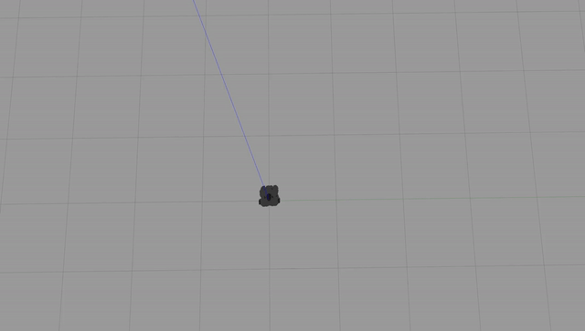

# warmup_project
**Robot Behaviors**
*Drive in a square:* In order to allow the robot to drive in a square we need 2 basic components, a 90 degree (or close) turn, and a forward movement of consistent distance.
  - Main: initializes an object of *SendTwistData*, and calls its run function
  - Init: creates the ROS node and creates the publisher to post the cmd_vel commands
  - Run: first we create two vectors, a *my_straight_vel* which contains a vector to drive straight, and a *my_turn_vel* which contains a vector to turn. We then set a few starting values to go straight before turning, and then start the loop. The loop checks whether we should be going straight or turning, and publishes the correct vector. Then we have a loop that sleeps either 10 or 50 ticks depending on whether we're driving straight or turning to get a good shape for the square. Lastly we swap between turning or going straight and vice versa, and reset our count.

**Challenges**
Working with the fact that robots have friction, even in a virtual world took longer than I expected. I found it was easier to work backward from knowing I wanted a pi/2 radian turn in 1 second, and setting my *Rate* and iteration count to achieve that turn. This was not a perfect solution but it was much easier than using a rotation vector not based on pi.

**Future Work**
If I had more time, I likely would have implemented an odemetry node and use that to help increase the precision of the robot turns. This however would require a significant restructure of the loop since I stay within a *sleep()* call most of the time and wouldn't consistenly publish the necessary odemetry data.

**Takeaways**
-Robots obey a lot of physics rules, such as friction, but also it takes time to speed up and slow down, and appears to have some level of momentum. This means that if you're moving too fast or change directions it takes a moment to switch or stop.
-Sensors are very valuable. Having a good idea where the roobt is in space makes timing and ending up in the correct possition massively easier. Since there weren't walls or something else to interact with.
